```mermaid
graph TD
    A[🚨 Trigger: New SIEM Alert] --> B[🤖 AI Agent: Triage Alert]
    B --> C[🔧 API: CMDB]
    B --> D[👤 API: IAM]
    B --> E[🛡️ API: Threat Intel]
    C --> F[📊 Logic: Calculate Risk Score]
    D --> F
    E --> F
    F --> G{Risk Score}
    G -->|Risk > 80| H[🔴 Action: Escalate to L1 Analyst Queue]
    G -->|Risk ≤ 80| I[⚪ Action: Auto-close Ticket as Low Priority]
    
    style A fill:#ff6b6b,stroke:#333,stroke-width:2px,color:#fff
    style B fill:#4ecdc4,stroke:#333,stroke-width:2px,color:#fff
    style F fill:#45b7d1,stroke:#333,stroke-width:2px,color:#fff
    style H fill:#ff9999,stroke:#333,stroke-width:2px,color:#000
    style I fill:#99ff99,stroke:#333,stroke-width:2px,color:#000
```

```mermaid
graph TD
    A[⏰ Trigger: Cron Daily] --> B[🤖 AI Agent: Analyze for New Rules]
    B --> C[🎯 API: BAS Results]
    B --> D[🔍 API: Vuln Scanner]
    B --> E[🛡️ API: Threat Intel]
    C --> F[🧠 Logic: Correlate TTPs with Vulnerabilities and Attack Paths]
    D --> F
    E --> F
    F --> G[🤖 AI Agent: Synthesize Sigma/YARA Rule]
    G --> H[📝 Action: Commit Rule to Detection Engineering Git Repo]
    
    style A fill:#ffd93d,color:#000
    style B fill:#4ecdc4,color:#000
    style F fill:#45b7d1,color:#fff
    style G fill:#6c5ce7,color:#fff
    style H fill:#00b894,color:#fff
```

```mermaid
graph TD
    A[📅 Trigger: Cron Weekly] --> B[🤖 AI Agent: Analyze Coverage]
    B --> C[🔍 API: SIEM Get Rules]
    B --> D[🏢 API: CMDB Get Assets]
    B --> E[🎯 API: MITRE ATT&CK]
    C --> F[📊 Logic: Map Active Rules & Log Sources to ATT&CK Techniques]
    D --> F
    E --> F
    F --> G[🔍 Logic: Identify Uncovered Techniques on Active Assets]
    G --> H[📈 Action: Update PowerBI Dashboard]
    G --> I[🎫 Action: Create Jira Ticket for Missing Detection]
    
    style A fill:#a29bfe,color:#fff
    style B fill:#4ecdc4,color:#000
    style F fill:#45b7d1,color:#fff
    style G fill:#fd79a8,color:#fff
    style H fill:#00b894,color:#fff
    style I fill:#fdcb6e,color:#000
```

```mermaid
graph TD
    A[🚨 Trigger: New High-Confidence Incident in ITSM] --> B[🤖 AI Agent: Investigate Incident]
    B --> C[💻 API: EDR Get Endpoint Logs]
    B --> D[👤 API: IAM Get Auth Logs]
    B --> E[☁️ API: CloudTrail/Azure Logs]
    C --> F[🤖 AI Agent: Compile Summary & Timeline]
    D --> F
    E --> F
    F --> G[📝 Action: Update ITSM Ticket with Enriched Data]
    
    style A fill:#e17055,color:#fff
    style B fill:#4ecdc4,color:#000
    style F fill:#6c5ce7,color:#fff
    style G fill:#00b894,color:#fff
```

```mermaid
graph TD
    A[✅ Trigger: Incident Status = Confirmed] --> B[🤖 AI Agent: Notify Stakeholder]
    B --> C[🏢 API: CMDB Get Asset Owner]
    C --> D[💬 Action: Send Teams Message to Asset Owner]
    D --> E[⏳ Logic: Wait 30 Mins for Response]
    E --> F{Response?}
    F -->|No Response| G[🤖 AI Agent: Escalate]
    F -->|Response| H[📝 Action: Log Acknowledgement to ITSM Ticket]
    G --> I[👤 API: IAM Get Manager]
    I --> J[📧 Action: Send Email to Manager]
    
    style A fill:#00b894,color:#fff
    style B fill:#4ecdc4,color:#000
    style E fill:#fdcb6e,color:#000
    style G fill:#e17055,color:#fff
    style H fill:#00b894,color:#fff
```

```mermaid
graph TD
    A[⏰ Trigger: Cron Hourly] --> B[🤖 AI Agent: Run UEBA Models]
    B --> C[🗄️ API: Data Lake Get Logs]
    C --> D[📊 Logic: Identify Statistical Anomalies]
    D --> E[🤖 AI Agent: Score Anomaly & Correlate to TTP]
    E --> F{Score Level}
    F -->|Score > High| G[🎯 Action: Create Hunt Lead Ticket for L2 Team]
    F -->|Score ≤ High| H[🔚 End]
    
    style A fill:#a29bfe,color:#fff
    style B fill:#4ecdc4,color:#000
    style D fill:#45b7d1,color:#fff
    style E fill:#6c5ce7,color:#fff
    style G fill:#fd79a8,color:#fff
    style H fill:#ddd,color:#000
```

```mermaid
graph TD
    A[🚨 Trigger: New CRITICAL Alert e.g. Ransomware] --> B[📋 Logic: Match Alert against Pre-Approved Action Catalog]
    B --> C[🤖 AI Agent: Execute Containment]
    C --> D[💻 API: EDR Isolate Host]
    C --> E[👤 API: IAM Disable User]
    D --> F[📝 Action: Log Containment Action to ITSM Ticket]
    E --> F
    
    style A fill:#e74c3c,color:#fff
    style B fill:#f39c12,color:#fff
    style C fill:#4ecdc4,color:#000
    style D fill:#9b59b6,color:#fff
    style E fill:#3498db,color:#fff
    style F fill:#00b894,color:#fff
```

```mermaid
graph TD
    A[🔍 Trigger: New Vulnerability Scan Complete] --> B[🤖 AI Agent: Prioritize Vulns]
    B --> C[🏢 API: CMDB Get Asset Criticality]
    B --> D[🛡️ API: Threat Intel Get Exploit Status]
    C --> E[📊 Logic: Calculate Risk Score CVSS + TI + Business Context]
    D --> E
    E --> F[🤖 AI Agent: Generate Tasks]
    F --> G[🎫 API: ITSM Create Ticket]
    G --> H[👤 Action: Assign Ticket to Asset Owner]
    
    style A fill:#3498db,color:#fff
    style B fill:#4ecdc4,color:#000
    style E fill:#45b7d1,color:#fff
    style F fill:#6c5ce7,color:#fff
    style G fill:#e67e22,color:#fff
    style H fill:#00b894,color:#fff
```

```mermaid
graph TD
    A[✅ Trigger: Confirmed True Positive Alert from Triage] --> B[🤖 AI Agent: Playbook Generator]
    B --> C[🔍 Tool: Analyze Incident Context]
    B --> D[🛡️ Tool: Correlate Threat Intelligence]
    C --> E[📋 Logic: Generate Tailored Playbook Steps]
    D --> E
    E --> F[👨‍💻 Action: Present Playbook to Analyst for Approval]
    F --> G{Analyst Decision}
    G -->|Approves| H[🤖 AI Agent: Execution Agent]
    G -->|Rejects| I[📝 Action: Log Feedback & Escalate for Manual Response]
    H --> J[💻 API: EDR Isolate Host]
    H --> K[🛡️ API: Firewall Block IP]
    H --> L[👤 API: IAM Disable User]
    J --> M[📊 Action: Execute Response & Log]
    K --> M
    L --> M
    
    style A fill:#00b894,color:#fff
    style B fill:#4ecdc4,color:#000
    style E fill:#6c5ce7,color:#fff
    style F fill:#f39c12,color:#fff
    style H fill:#e74c3c,color:#fff
    style I fill:#95a5a6,color:#fff
    style M fill:#00b894,color:#fff
```

# 🤖 AI for Security Operations (AI4SecOps) Use Cases

*Transforming Security Operations with Artificial Intelligence*

---

## 📋 Table of Contents

| # | Use Case | Focus Area | Impact |
|---|----------|------------|--------|
| [1](#1-🎯-ai-powered-alert-triage-and-prioritization) | 🎯 **Alert Triage & Prioritization** | L1 Automation | 90% Auto-closure |
| [2](#2-🔍-ai-driven-contextual-detection-rule-generation) | 🔍 **Detection Rule Generation** | Proactive Defense | 50% True-positive ↑ |
| [3](#3-📊-ai-driven-detection-coverage-and-gap-analysis) | 📊 **Coverage Gap Analysis** | Visibility Assessment | MITRE ATT&CK Mapping |
| [4](#4-🔬-automated-incident-investigation-and-enrichment) | 🔬 **Incident Investigation** | Evidence Gathering | MTTR Reduction |
| [5](#5-📢-automated-communication-and-escalation-to-asset-owners) | 📢 **Communication & Escalation** | Stakeholder Management | SLA Compliance |
| [6](#6-🕵️-proactive-threat-hunting-with-behavioral-analysis) | 🕵️ **Threat Hunting** | Behavioral Analysis | Advanced Threat Detection |
| [7](#7-⚡-automated-security-control-and-policy-enforcement) | ⚡ **Automated Response** | Containment | <1 min MTTC |
| [8](#8-🛡️-intelligent-vulnerability-management-and-prioritization) | 🛡️ **Vulnerability Management** | Risk Prioritization | Dynamic Risk Scoring |
| [9](#9-📧-automated-phishing-and-social-engineering-detection) | 📧 **Email Security** | Phishing Prevention | Real-time Analysis |
| [10](#10-📖-dynamic-playbook-generation-and-orchestration) | 📖 **Dynamic Playbooks** | Response Orchestration | 75% MTTC Reduction |

---

## 1. 🎯 AI-Powered Alert Triage and Prioritization

### 📋 **Requirement**
We will implement an AI-driven system to automate the L1 security alert triage process. This system is required to ingest the entirety of our alert volume from all detection sources, including our SIEM, EDR, and NDR platforms. It must then programmatically enrich each alert with critical context by integrating with our CMDB for asset business value, our IAM platform for user roles and privileges, and our threat intelligence platform for correlation with active external threats. The AI's core function is to apply a multi-factor risk model to score and prioritize these alerts. The primary success metric will be the autonomous closure of over 90% of incoming alerts identified as false positives or non-critical events. Only high-confidence, fully enriched alerts posing a tangible risk to the business will be escalated to the L1 analyst queue. This capability is mandated to reduce analyst fatigue and operational overhead, standardize our initial response, and ensure our human capital is focused exclusively on investigating credible threats, thereby materially reducing our Mean Time to Acknowledge (MTTA).

### 🔄 **Agentic Workflow Visual**

---

## 2. 🔍 AI-Driven Contextual Detection Rule Generation

### 📋 **Requirement**
Our detection engineering capability must evolve from a reactive, manual process to a proactive, automated function. We will deploy an AI system dedicated to generating and recommending high-fidelity, contextual detection rules. This system is required to synthesize data from our Breach and Attack Simulation (BAS) platform, our vulnerability scanners, and external threat intelligence feeds. It must be capable of identifying gaps in our defenses highlighted by BAS results and correlating known attacker TTPs with confirmed vulnerabilities present in our environment. Based on this analysis, the AI will generate precise detection logic for our SIEM and EDR platforms. The strategic goal is to create rules that are not generic, but are specifically tailored to our attack surface and the active threat landscape. Success will be measured by a 50% increase in the true-positive rate of newly created detections and the ability to link over 70% of these rules directly to a known internal vulnerability or an active threat campaign.

### 🔄 **Agentic Workflow Visual**

---

## 3. 📊 AI-Driven Detection Coverage and Gap Analysis

### 📋 **Requirement**
We must move beyond assumptions about our security visibility and implement a data-driven process for identifying detection gaps. We will deploy an AI agent to perform continuous detection coverage analysis. This system is required to map our entire portfolio of active detection rules and available log telemetry against the comprehensive MITRE ATT&CK framework. Crucially, it must then cross-reference this coverage map with our CMDB and infrastructure-as-code repositories to understand our technology stack—including operating systems, cloud services, and critical applications. The AI's primary function is to identify and prioritize gaps where a relevant attacker TTP exists for which we have no effective detection logic. The output must be a dynamic dashboard that visualizes our coverage and provides a prioritized list of missing detections based on asset criticality and threat actor relevance. This answers the critical question, "What can't we see?" and provides a strategic roadmap for our detection engineering efforts.

### 🔄 **Agentic Workflow Visual**

---

## 4. 🔬 Automated Incident Investigation and Enrichment

### 📋 **Requirement**
To accelerate our incident response lifecycle, we require the automation of the evidence-gathering phase. Upon the escalation of a high-confidence alert from our triage system, an automated investigation workflow must be triggered. This system will integrate via API with our primary log sources, endpoint agents, cloud provider consoles, and identity management systems to execute predefined data collection playbooks tailored to the incident type. For example, a malware alert would trigger the collection of endpoint process history, network connection logs, and parent process information. A credential compromise alert would trigger the retrieval of all authentication logs for the affected user across all systems for the preceding 72 hours. The system must compile this data into a structured incident timeline, automatically attach it to the master case file in our ITSM, and present it to the responder. This will eliminate manual data gathering, enforce a consistent investigation methodology, and significantly reduce our Mean Time to Resolution (MTTR).

### 🔄 **Agentic Workflow Visual**

---

## 5. 📢 Automated Communication and Escalation to Asset Owners

### 📋 **Requirement**
We must implement a system to automate incident stakeholder communication, ensuring rapid engagement and clear accountability. This system will integrate directly with our ITSM platform and corporate directory to identify the correct business and technical owners for any asset involved in an incident. Based on the incident's severity and classification, the system will use pre-approved templates to generate a clear, context-rich notification and deliver it through designated corporate channels, such as email and enterprise messaging platforms. A critical function of this system is to monitor for an acknowledgement from the asset owner within a defined Service Level Agreement (SLA). If an acknowledgement is not received, the system must automatically execute a defined escalation path to the owner's line manager or division head. All communications and acknowledgements must be logged as an auditable record in the incident ticket, freeing the SOC from administrative tasks during critical events.

### 🔄 **Agentic Workflow Visual**

---

## 6. 🕵️ Proactive Threat Hunting with Behavioral Analysis

### 📋 **Requirement**
Our security posture must mature to include the proactive discovery of threats that have bypassed our preventative and signature-based controls. We will deploy an AI system to perform continuous behavioral analysis and anomaly detection. The system is required to ingest and model telemetry from critical assets, including endpoint process logs, DNS queries, network flow data, and cloud control plane activity. Using machine learning, it will establish dynamic baselines of normal behavior for key entities, such as privileged users, critical servers, and administrative services. The primary function is to identify and score statistically significant deviations from these baselines that align with known attacker TTPs, such as unusual lateral movement or anomalous data access patterns. Each AI-generated hunt lead, complete with its supporting evidence, must be delivered to our L2/L3 threat hunting team for validation, thus enhancing our ability to find novel and sophisticated threats early.

### 🔄 **Agentic Workflow Visual**

---

## 7. ⚡ Automated Security Control and Policy Enforcement

### 📋 **Requirement**
To minimize the business impact of a security incident, we will implement a machine-speed containment capability. This "Automated Response" system will be integrated with our core security enforcement points, including our EDR platform, network firewalls, cloud security groups, and our Identity and Access Management solution. We will develop a catalog of pre-approved, automated response actions that correspond to specific, high-confidence incident types. For example, a confirmed ransomware execution alert must trigger an immediate EDR action to isolate the host from the network. A confirmed credential compromise alert must trigger an automated action to disable the user account and terminate all active sessions. The execution of any automated action must be governed by a strict approval framework and be logged with a full audit trail in the corresponding incident ticket. The key metric for this capability is to reduce our Mean Time to Contain (MTTC) for applicable threats to under one minute.

### 🔄 **Agentic Workflow Visual**

---

## 8. 🛡️ Intelligent Vulnerability Management and Prioritization

### 📋 **Requirement**
Our vulnerability management program must be optimized to focus remediation efforts on vulnerabilities that represent a quantifiable and immediate risk to the organization. We will deploy an AI system to ingest all data from our network and application vulnerability scanners and enrich it with business context from our CMDB. Crucially, the system must also integrate with multiple external threat intelligence feeds to determine if a public exploit exists for a given CVE and if that CVE is being actively exploited in the wild. The system's core function is to correlate these data sets to generate a unified, dynamic risk score for each vulnerability instance. This will allow us to move beyond static CVSS scoring. The system will then generate prioritized remediation lists and automatically create tickets in our ITSM platform, assigned to the correct asset owners with all supporting context, thus ensuring our resources are focused on mitigating the most critical threats.

### 🔄 **Agentic Workflow Visual**

---

## 9. 📧 Automated Phishing and Social Engineering Detection

### 📋 **Requirement**
We will deploy an AI-based email security solution to mitigate the risk from our primary attack vector. This system must integrate with our cloud email platform at the API level to analyze all inbound, outbound, and internal email traffic in real time. It is required to move beyond traditional signature and reputation analysis. The AI must utilize Natural Language Understanding (NLU) to analyze email content for indicators of urgency, impersonation, and unusual financial requests characteristic of Business Email Compromise (BEC). Concurrently, it will perform behavioral analysis to flag deviations from established communication patterns. Upon detecting a high-confidence threat, the system must be empowered to automatically quarantine the message and submit all malicious indicators to our threat intelligence platform. This will automate the neutralization of email-borne threats before they reach the end-user, significantly reducing the incident volume originating from this vector.

### 🔄 **Agentic Workflow Visual**

---

## 10. 📖 Dynamic Playbook Generation and Orchestration

### 📋 **Requirement**
We will deploy an advanced AI agent responsible for the dynamic generation and orchestrated execution of response playbooks for all confirmed true positive security incidents. Upon receiving an escalated, enriched alert from the L1 triage system, this agent is required to perform a deep analysis of the incident's specific context, including the attack vector, asset criticality, user privileges, and identified Indicators of Compromise (IoCs). Its core function is to dynamically assemble a best-practice, step-by-step response playbook tailored to the unique characteristics of the threat. This generated playbook must be presented to the handling security analyst for explicit approval. Following validation, the system will programmatically execute the approved actions by integrating with our SOAR, EDR, firewall, and IAM platforms. The primary success metric is a 75% reduction in Mean Time to Contain (MTTC) for critical incidents. This capability is mandated to standardize complex response procedures, eliminate manual execution errors, and accelerate containment of active threats, thereby significantly reducing the potential impact of a breach.

### 🔄 **Agentic Workflow Visual**

---

## 🎯 Success Metrics Summary

| Use Case | Key Metric | Target Value |
|----------|------------|--------------|
| 🎯 **Alert Triage** | Auto-closure Rate | **>90%** |
| 🔍 **Detection Rules** | True-positive Rate | **+50%** |
| 📊 **Coverage Analysis** | Rule Linkage | **>70%** |
| 🔬 **Investigation** | Process Efficiency | **MTTR ↓** |
| 📢 **Communication** | SLA Compliance | **100%** |
| 🕵️ **Threat Hunting** | Hunt Lead Quality | **L2/L3 Validated** |
| ⚡ **Auto Response** | Mean Time to Contain | **<1 minute** |
| 🛡️ **Vuln Management** | Risk-based Prioritization | **Dynamic Scoring** |
| 📧 **Email Security** | Threat Neutralization | **Pre-delivery** |
| 📖 **Dynamic Playbooks** | MTTC Reduction | **75%** |

---

## 🛠️ Integration Points

<table>
<tr>
<th>Platform</th>
<th>Integration Type</th>
<th>Use Cases</th>
</tr>
<tr>
<td>🏢 <strong>CMDB</strong></td>
<td>API Integration</td>
<td>1, 3, 5, 8</td>
</tr>
<tr>
<td>👤 <strong>IAM</strong></td>
<td>API Integration</td>
<td>1, 4, 5, 7</td>
</tr>
<tr>
<td>🛡️ <strong>Threat Intelligence</strong></td>
<td>API Integration</td>
<td>1, 2, 8, 9, 10</td>
</tr>
<tr>
<td>💻 <strong>EDR</strong></td>
<td>API Integration</td>
<td>1, 2, 4, 7, 10</td>
</tr>
<tr>
<td>🔍 <strong>SIEM</strong></td>
<td>API Integration</td>
<td>1, 2, 3</td>
</tr>
<tr>
<td>🎫 <strong>ITSM</strong></td>
<td>API Integration</td>
<td>4, 5, 8</td>
</tr>
</table>

---

*Made with ❤️ for the Security Operations Community*

**[⬆️ Back to Top](#-ai-for-security-operations-ai4secops-use-cases)**

